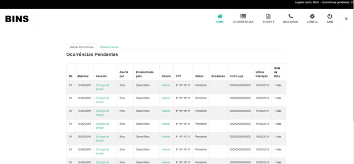

# SISTEMA DE ATENDIMENTO - Final

Este é um prototipo de um sistema de atendimento, feito com ReactJS. Ele está integrado a uma API feita com NodeJS + SQL Server. O sistema permite validar a navegação e a consulta de cadastros e ocorrências.

A API feita em NodeJS + SQL Server utilizada por este sistema pode ser vista neste repositórios

https://github.com/dbins/atendimento_api

Para acessar o protótipo deste sistema com uma API de testes (sem banco de dados), basta instalar o sistema deste link:

https://github.com/dbins/atendimento

Recursos que foram utilizados:

- Axios
- Redux
- Saga
- React Navigation
- Styled Components
- ReactoTron
- ESLint
- Prettier

Se deseja ver um vídeo deste aplicativo, abra este endereço [http://www.dbins.com.br/videos/atendimento.mp4](http://www.dbins.com.br/videos/atendimento.mp4)